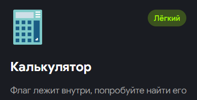
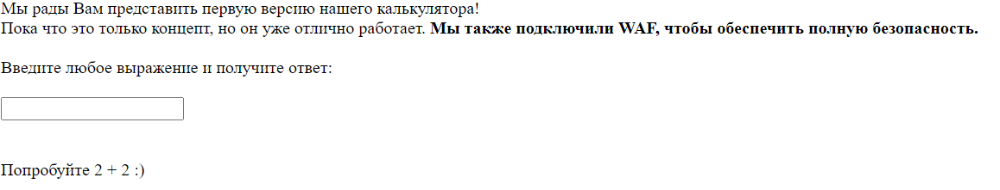
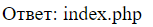
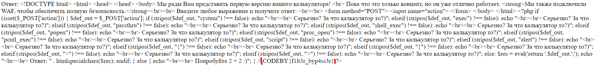

Привет, сейчас мы решим таск калькулятор с Codeby Games.
Я постараюсь не только показать решение, но и обЪяснить логику происходящего.
Поехали!

И так, переходим по адресу из задания и видим собственно калькулятор:

Проверяем что он действительно работает: введем 2 + 2 и получим 4.\n
Попробуем ввести "", на что получим "Серьезно? За что калькулятор то?".\n
Соответственно есть валидация каких либо символов и строк.\n
Можем предположить что логика калькулятора написана на php(тк страница называется index.php).\n
Каким образом это может быть реализовано?\n
Поскольку выражение может быть любой длины, а так же без пробелов(а так же передается в 1 POST параметре), скорее всего используется какая то функция, которая выполняет арифметические выражения записанные в формате строки.Например: функция('3+1-2') -> 2.\n
В php такой функционал может реализовать eval(). - https://www.php.net/manual/ru/function.eval.php.\n
eval() выполняет php команды, переданные в строке. \n
Получаем что в php коде есть что то вроде eval ('return'.$_POST['action'].';');\n
Которая по сути означает: вверни результат введенной нами команды. return в данном случае отвечает за возвращение результата куда либо.
Отлично, получается php выполнит все что мы введем?\n
Давайте попробую использовать функцию shell_exec(), которая выполняет команды через оболочку.\n
Но мы снова получаем "Серьезно? За что калькулятор то?)", во-первых, мы снова столкнулись с валидацией, во-вторых, значит мы на верном пути.\n
Но все из подходящих нам функций валидируются( На этом моменте стоит вспомнить о том, что в php существуют операторы - https://www.php.net/manual/ru/language.operators.php \n
Оператор - это некая сущность, которая что то принимает и что то с этим делает.(Максимально понятно и подробно...)\n
В этой статье находим оператор исполнения \`\`(очень важно что не '').\n
Попробуем ввести какую то команду в \`\`, например ls.\n

Отлично! Скорее читаем файл, введя \`cat index.php\` \n
И получаем долгожданный флаг!

Спасибо за прочтение, если вы заметили какую-то неточность в моем рассказе или просто хотите что то уточнить, вы всегда можете мне написать @Vihl9 