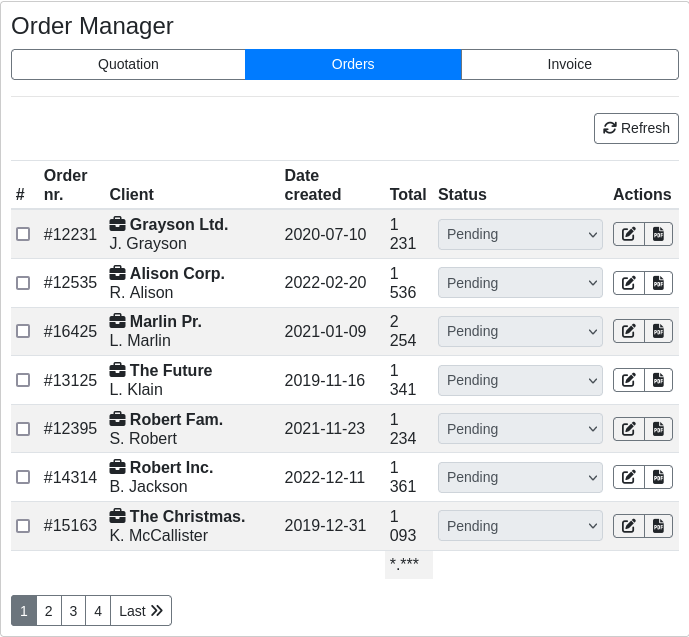
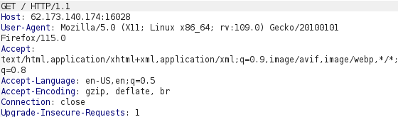
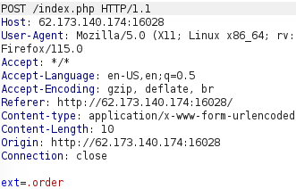
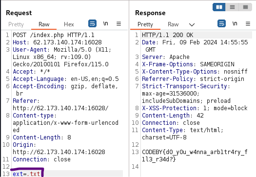
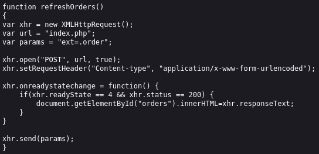
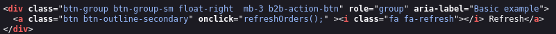

Привет, сейчас мы решим таск нулевой заказ с Codeby Games.
Я постараюсь не только показать решение, но и объяснить логику происходящего.
Поехали!

Заходим в приложение и видим следующую картину:

Пытаемся нажимать на разные кнопочки, но ничего не происходит(.
Хорошо, давайте откроем Burp Suit и посмотрим что же мы вообще отправляем на сервер.
При простом обновлении странице не видим ничего интересного.

Посмотрим что происходит при нажатии на различные кнопки приложения, видим что refresh отправляет POST запрос с каким то параметром ext:

Небольшая справка "Extended File System (расширенная файловая система), сокращённо ext или extfs — первая файловая система, разработанная специально для ОС на ядре Linux. Представлена в апреле 1992 г. для ядра Linux 0.96c."

Можно предположить что нам выдают все файлы с расширением .order, попробуем подобрать нужно значение. Закидываем запрос в repeater с помощью ctrl + R, изменяем значение параметра на .txt и отправляем.

Поздравляю, у нас есть флаг!!!

Так же в самом конце html страницы видим js код:

В котором лежит следующее:

Именно тут мы создаем асинхронный пост запрос на index.php, который отправляется при нажатии на кнопку refresh, после чего вставляем в разметку текст из ответа.

Ну а вызывается эта функция(соответственно отправляется запрос) в соответствующем теге:

Спасибо за прочтение, если вы заметили какую-то неточность в моем рассказе или просто хотите что то уточнить, вы всегда можете мне написать @Vihl9